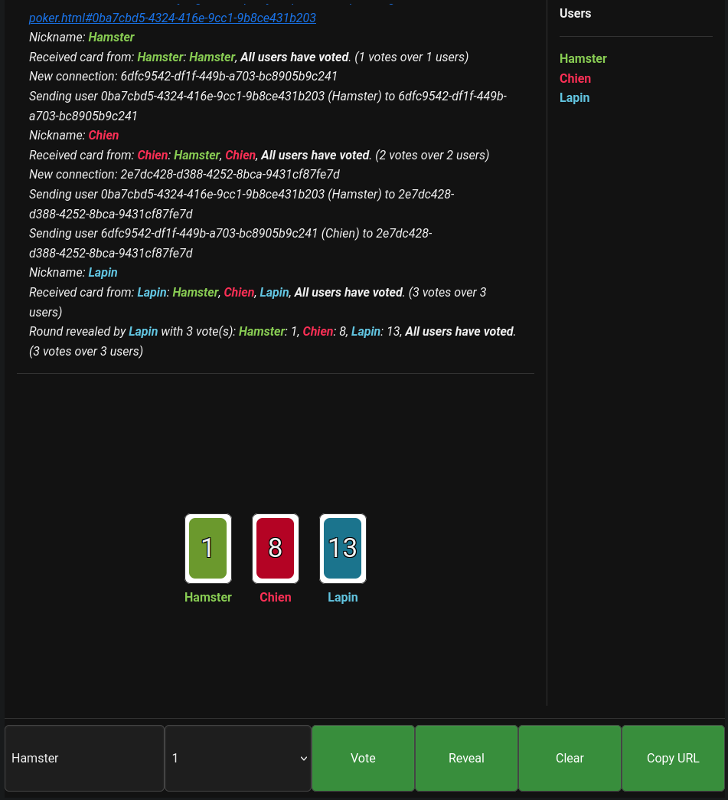

client-side multi-user realtime experiments using [peerjs](https://peerjs.com/).

## How it works

`room.js` defines a `Room` class.
A room has a server and clients.
Basically, the server is a peer that clients connect to, and it forwards messages between clients.
If the server is closed, a new client can become the server, and the room continues to work.

## Demos:

- [chat](https://yazgoo.github.io/peerjs-experiments/chat.html)
- [planning poker](https://yazgoo.github.io/peerjs-experiments/planning-poker.html)

Also, there are CLI implementations, for example:

```bash
node chat.js
```

## Screenshot


